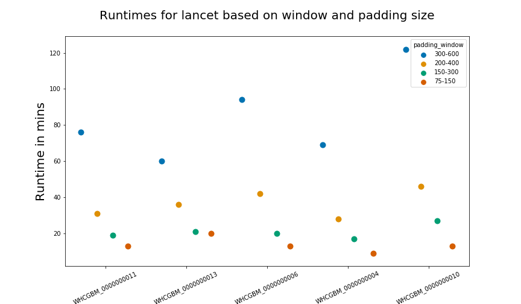

# Lancet parameters for canine WGS pipeline 

Lancet is the only variant caller that runs WGS samples as exome mode. Two parameters that are  used to choose which reads are included in variant calling regions towards the edges of BED file region are, window and padding. Typically in hg38 pipeline padding value of 300 and window value of 600 was used. Canine samples were running for more than an hour with this setting. In this analysis, we tried to  assess if reducing padding and window size was an option without comprimising on the sensitivity values. Lancet also includes VCF regions from mutect2 and strelka2 as variant calling regions apart from the exome BED that is submitted. So lancet will not start until Mutect2 and Strelka2 are completed in the workflow. Because of this, reducing time on lancet will help reduce the overall runtime it takes for the whole pipeline. 

1. Comparing runtimes 

Apart from the runtime of 300-600, runtimes for padding and window values of 200-400, 150-300 and 75-150 were  assessed. The plot  below shows the runtime for different parameters 
