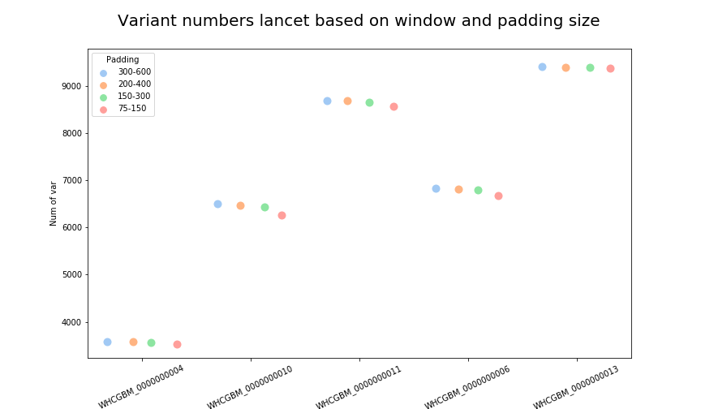

# Lancet parameters for canine WGS pipeline 

Lancet is the only variant caller that runs WGS samples as exome mode. Two parameters that are  used to choose which reads are included in variant calling regions towards the edges of BED file region are, window and padding. Typically in hg38 pipeline padding value of 300 and window value of 600 was used. Canine samples were running for more than an hour with this setting. In this analysis, we tried to  assess if reducing padding and window size was an option without comprimising on the sensitivity values. Lancet also includes VCF regions from mutect2 and strelka2 as variant calling regions apart from the exome BED that is submitted. So lancet will not start until Mutect2 and Strelka2 are completed in the workflow. Because of this, reducing time on lancet will help reduce the overall runtime it takes for the whole pipeline. 

1. Comparing runtimes 

Apart from the runtime of 300-600, runtimes for padding and window values of 200-400, 150-300 and 75-150 were  assessed. The plot  below shows the runtime for different parameters 

- Inputs used - File with all samples and runtimes - `inputs/runtimes.txt`
- Python code - `runtime_comparisons.ipynb`
- Output - `results/runtime_comparison.png`

2. Comparing variants

Each VCF file run at  every padding/window length  was used to run consensus(same inputs  used for mutect2, vardict  and strelka2). All the  VCF files were converted to BED files (so indels can be represented as multi base regions) and bedtools was used to compare variants of all lancet parameters with 300-600. Number of variants at each window-padding size is shown below

- Inputs used - File with all BEDs listed here - `inputs/consensus_all_samples.txt`
- Code and readme - `vcf_var_comparison_commands`
- Output - 
    - `results/all_samples_consensus_comparisons` - This file has variant numbers  and also annotations/locations of where  the missing variants are
    - `results/var_comparison.pn`

 3. Comparing variant allele frequencies

 Variant allele frequencies between different padding and window size combinations are compared using lancet VCF files. Variant allele frequencies are calculated from the VCF files using (alt allele DP/total DP from tumor sample). Violin plots below show that the VAF do not vary between different padding lengths except for 75-100 
 
 - Inputs used - File with lancet VCF files - `inputs/all_samples_bedfiles.txt`
 - Code -   `VAF_plots.ipynb`
 - Output - `results/variant_allele_frequencies.png`

##### Conclusion

Most of  the runtime difference was when we switched from 300-600 to 200-400. There  is not a significant number of  variants lost between both these parameters. Also note, canine samples were sequenced at 151 read length. So switching to 200-400 (or even 150-300?) cuts down the runtime for the the whole WGS workflow

    